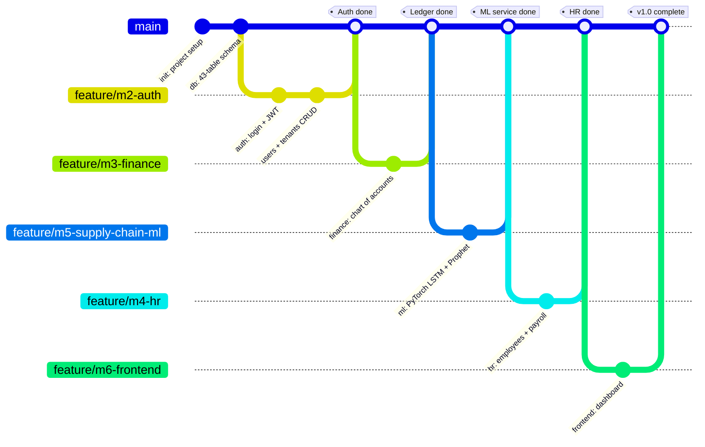

# Amdox ERP — Git Branch Timeline

> Render at https://mermaid.live or any Mermaid-enabled viewer (GitHub renders it automatically).

## How to read it
- **main** (bottom line) = the complete application — every feature merges here
- Each **branch** = one member building one module
- Each **merge** = that module's finished work joining `main`
- **tags** = milestones (e.g. "Ledger done")

## Your current situation
- `feature/m3-finance` → **Ledger** already merged into `main`
- `feature/m5-supply-chain-ml` → **ML Service** ready to merge into `main` next
